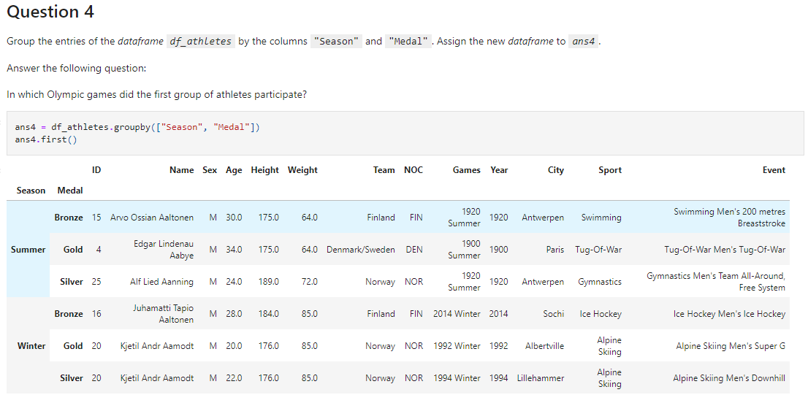

# Analyze data in pandas.

In this project, data analysis with python and pandas is applied to analyze data from athletes from the last 120 years of olympics. Some of the analyzes performed used:

- `left join`
- `pivot`
- `group by`
- `max`, `min`, `mean`

The database for this project is available at: [https://www.kaggle.com/heesoo37/120-years-of-olympic-history-athletes-and-results](https://www.kaggle.com/heesoo37/120-years-of-olympic-history-athletes-and-results)

## Technologies:

**Python3**

**Pandas** 

## **Learning Outcome Addressed**
Analyze data in pandas.

## Overview:

### References

MIT - Professional Certificated in Data Engineer. 

“120 years of Olympic history: athletes and results.”
[https://www.kaggle.com/heesoo37/120-years-of-olympic-history-athletes-and-results](https://www.kaggle.com/heesoo37/120-years-of-olympic-history-athletes-and-results) .